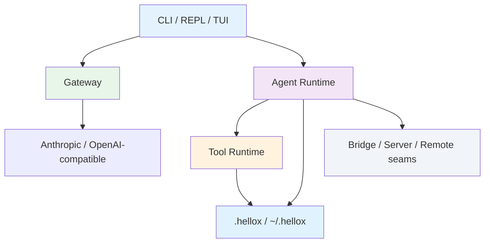

<div align="center">
  
</div>

# Hellox

<div align="center">

**A Rust-native, local-first coding agent platform inspired by Claude Code, rebuilt around Gateway + CLI + REPL + tool runtime.**

[](./LICENSE)
[](./Cargo.toml)
[](https://www.rust-lang.org/)
[](./CONTRIBUTING.md)

</div>

<p align="center">
  <a href="./README.md"></a>
  <a href="./README_CN.md"></a>
</p>

---

## 📑 Table of Contents

<details>
<summary><strong>Click to expand</strong></summary>

- [🎯 Why Hellox?](#-why-hellox)
- [✨ Features](#-features)
- [🚀 Quick Start](#-quick-start)
- [🔧 How It Works](#-how-it-works)
- [📖 Documentation](#-documentation)
- [🆚 Positioning](#-positioning)
- [❓ FAQ](#-faq)
- [🛠️ Troubleshooting](#️-troubleshooting)
- [🤝 Contributing](#-contributing)
- [📜 License](#-license)

</details>

## 🎯 Why Hellox?

If you want a **local coding agent stack** that you can run, inspect, patch, and extend in Rust, this project is exactly about that.

Hellox follows a very deliberate product boundary:

- **local-first** by default
- **remote-capable** only as a future seam
- **no cloud dependency** on the primary path
- **Claude Code–style workflows** rebuilt in Rust crates instead of copied TypeScript internals

| Challenge | Without Hellox | With Hellox |
|------|-------------|-----------|
| Local execution | You stitch together separate CLIs, scripts, and adapters | A single Rust workspace covers gateway, CLI, REPL, tools, sessions, memory, and workflow runtime |
| Provider abstraction | Each provider is wired differently | Gateway exposes a unified local API and profile model |
| Tooling surface | File, shell, MCP, task, and workflow logic sprawl across the app | Tool runtime and `hellox-tools-*` crates split responsibilities cleanly |
| Workflow authoring | Scripts are hard to inspect and debug locally | Overview, panel, run history, run inspect, selectors, and step lenses are built in |
| Team / sub-agent runtime | Local multi-agent control is fragile | Detached process, tmux, and iTerm backends already have runtime reconciliation and replay harnesses |

### 💡 Best fit
- ✅ **Local AI tooling builders** who want a hackable Rust codebase instead of a closed binary
- ✅ **Power users** who want CLI + REPL + workflow panels in one local workspace
- ✅ **Agent/runtime researchers** who care about tool registries, permissions, telemetry, and workflow orchestration

### ⚠️ Not ideal for
- ❌ People who only want a polished hosted SaaS with no local setup
- ❌ Teams that require a production-ready cloud control plane today
- ❌ Users expecting the full original Claude Code UX to be 100% complete already

<div align="center">
  
</div>

## ✨ Features

Here is the short version: Hellox already covers a lot of the local path.

<table>
<tr>
<td width="50%" valign="top">


**🧭 Local gateway + provider layer**

- Anthropic-compatible local gateway
- OpenAI-compatible provider support
- Local file upload → persistence → message consumption loop
- Profiles, models, and provider adapters in one place

**Your benefit:** you get one local entry point instead of juggling provider-specific wrappers.

</td>
<td width="50%" valign="top">


**💬 CLI / REPL / TUI surfaces**

- `chat`, `repl`, `session`, `memory`, `tasks`, `workflow`, `mcp`, `plugin`
- `rustyline`-based REPL loop
- selector + lens terminal panels
- status / doctor / usage / cost inspection

**Your benefit:** the day-to-day operator surface is already real, not just planned.

</td>
</tr>
<tr>
<td width="50%" valign="top">


**⚡ Tool + workflow runtime**

- `Read`, `Write`, `Edit`, `Glob`, `Grep`, `NotebookEdit`
- `Bash` / `PowerShell`, `WebFetch` / `WebSearch`
- task, plan mode, MCP, team, workflow, sleep, remote-trigger seam
- workflow overview / panel / run inspect with step selectors

**Your benefit:** local coding-agent primitives are already structured into reusable crates.

</td>
<td width="50%" valign="top">


**🛡️ Observability + local control**

- persisted sessions, compact, memory lifecycle
- telemetry JSONL sink
- pane-host record/replay harness
- detached process, tmux, iTerm runtime support

**Your benefit:** debugging the runtime is practical because state and evidence stay local.

</td>
</tr>
</table>

### 📊 What is already true
- **31 workspace crates** split by responsibility
- **200+ CLI tests** passing in `hellox-cli`
- **full workspace tests** passing locally with `cargo test --workspace`
- **remote/cloud excluded by design** from the current mainline acceptance scope

## 🚀 Quick Start

### Prerequisites
- Rust toolchain with Cargo
- Windows PowerShell, macOS Terminal, or Linux shell
- A local API key / provider configuration if you want to talk to real models

### 1. Clone and build

```powershell
git clone https://github.com/hellowind777/hellox.git
cd hellox
cargo build
```

### 2. Verify the workspace

```powershell
cargo test --workspace
```

Expected outcome:

```text
test result: ok.
```

### 3. Explore the CLI

```powershell
cargo run -p hellox-cli -- --help
cargo run -p hellox-cli -- repl
```

Useful next commands:

```powershell
cargo run -p hellox-cli -- doctor
cargo run -p hellox-cli -- workflow overview
cargo run -p hellox-cli -- session panel
```

### Typical first-run loop

```powershell
# Inspect runtime health
cargo run -p hellox-cli -- doctor

# Open the REPL
cargo run -p hellox-cli -- repl

# Inside REPL, try:
/workflow overview
/tasks panel
/memory panel
```

## 🔧 How It Works

### Architecture overview

<div align="center">
  
</div>



### Main layers

| Layer | What it does | Key crates |
|------|------|------|
| CLI surface | Commands, REPL driver, terminal panels | `hellox-cli`, `hellox-repl`, `hellox-tui` |
| Query / agent runtime | Sessions, tool turns, planning, compact | `hellox-agent`, `hellox-query`, `hellox-compact` |
| Tool abstraction | Local tool registry and domain crates | `hellox-tool-runtime`, `hellox-tools-*` |
| Gateway / provider layer | Model-facing local API and adapters | `hellox-gateway`, provider crates |
| State / memory / telemetry | Sessions, memory, usage, logs | `hellox-session`, `hellox-memory`, `hellox-telemetry` |
| Optional local integrations | Bridge, server, remote seams | `hellox-bridge`, `hellox-server`, `hellox-remote`, `hellox-sync`, `hellox-auth` |

### Real example

Before:

```text
You need separate wrappers for provider APIs, local tools, workflow state, and team runtime.
```

After:

```text
Hellox keeps those concerns in one Rust workspace:
- gateway for providers
- agent/query for orchestration
- tools runtime for local actions
- session/memory/telemetry for evidence
- workflow panels for inspection
```

## 📖 Documentation

Public GitHub references are intentionally kept lightweight.
The internal AI development docs live only in the local development workspace and are
not published to GitHub.

### Public references

| Reference | Purpose |
|------|------|
| `README.md` | Public project overview, positioning, and quick start |
| `README_CN.md` | Chinese overview and onboarding |
| `Cargo.toml` | Workspace members and shared dependency facts |
| `crates/*` | Current source of truth for runtime behavior, commands, and tests |

### Workspace structure

| Domain | Representative crates |
|------|------|
| Runtime core | `hellox-agent`, `hellox-query`, `hellox-tool-runtime` |
| User surfaces | `hellox-cli`, `hellox-repl`, `hellox-tui` |
| Gateway / providers | `hellox-gateway`, `hellox-provider-anthropic`, `hellox-provider-openai-compatible` |
| Storage / memory / telemetry | `hellox-session`, `hellox-memory`, `hellox-telemetry`, `hellox-sync` |
| Tool domains | `hellox-tools-fs`, `hellox-tools-shell`, `hellox-tools-web`, `hellox-tools-task`, `hellox-tools-ui`, `hellox-tools-agent`, `hellox-tools-mcp` |
| Local integration seams | `hellox-bridge`, `hellox-server`, `hellox-remote`, `hellox-auth` |

## 🆚 Positioning

| Option | Good at | Trade-off | Hellox advantage |
|------|------|------|------|
| Closed hosted coding agents | Fast onboarding | Limited local control | Hellox keeps the runtime inspectable and hackable |
| Generic Rust CLI apps | Simpler scope | No agent stack | Hellox includes gateway, tools, workflows, memory, and multi-agent seams |
| Ad hoc local scripts | Flexible experiments | Hard to scale and debug | Hellox provides structured crates and persisted runtime evidence |

## ❓ FAQ

<details>
<summary><strong>Q: Is Hellox a full Claude Code clone?</strong></summary>

**A:** No. It is a Rust-native rebuild guided by the local feature matrix. The current goal is not 1:1 cloud parity; it is a strong local-first runtime.
</details>

<details>
<summary><strong>Q: Does Hellox require a server?</strong></summary>

**A:** Not on the primary path. The project supports user-managed remote targets as optional seams, but does not target hosted cloud services.
</details>

<details>
<summary><strong>Q: Is the REPL already interactive?</strong></summary>

**A:** Yes. It already supports slash commands, selector-style panels, workflow navigation, memory/tasks/session panels, and `rustyline` input handling.
</details>

<details>
<summary><strong>Q: What is still missing?</strong></summary>

**A:** The biggest remaining gaps are a fuller interactive `hellox-tui` application, richer visual workflow authoring, and real tmux/iTerm fixture capture on non-Windows hosts.
</details>

<details>
<summary><strong>Q: Can I use tmux/iTerm features on Windows?</strong></summary>

**A:** You can run the fake-host / contract tests and replay harnesses, but real host orchestration evidence still needs macOS/Linux recordings.
</details>

<details>
<summary><strong>Q: Where should I look first if I want to contribute?</strong></summary>

**A:** Start with `README.md`, `CONTRIBUTING.md`, `Cargo.toml`, and the relevant `crates/*` source and tests.
</details>

## 🛠️ Troubleshooting

### 1. `cargo test --workspace` is slow

**Why:** the workspace includes many crates and some long-running agent/runtime tests.

**What to do:**

```powershell
cargo test -p hellox-cli
cargo test -p hellox-agent
```

### 2. GitHub push fails because this folder is not a git repo

**Why:** this workspace may start as a plain local directory.

**Fix:**

```powershell
git init -b main
git add .
git commit -m "初始化仓库"
```

### 3. Workflow panels render but feel incomplete

**Why:** terminal selector + lens surfaces already exist, but the full visual authoring layer is still under active build-out.

**Fix:** use the current `workflow overview`, `workflow panel`, `workflow runs`, and `workflow show-run` commands as the supported path.

### 4. Real pane host behavior is hard to verify on Windows

**Why:** tmux/iTerm host execution is naturally non-Windows.

**Fix:** use the replay harness locally now, and collect real fixtures later on macOS/Linux.

### 5. Provider requests fail after startup

**Why:** local config or credentials may be incomplete.

**Fix:** inspect config and runtime state first:

```powershell
cargo run -p hellox-cli -- config show
cargo run -p hellox-cli -- doctor
```

## 🤝 Contributing

Please read [CONTRIBUTING.md](./CONTRIBUTING.md).
Please also follow [CODE_OF_CONDUCT.md](./CODE_OF_CONDUCT.md), and use
[SECURITY.md](./SECURITY.md) for sensitive security reports.

For practical first issues, the most valuable contribution areas right now are:

- richer `hellox-tui` interaction
- workflow visual authoring
- tmux/iTerm fixture capture and replay evidence
- local team-memory and assistant-viewer improvements

## 📜 License

This repository is licensed under the [Apache-2.0 License](./LICENSE).

See [LICENSE](./LICENSE) for full details.

---

<div align="center">

Built for a local-first future of coding agents.

[⬆ Back to top](#hellox)

</div>
