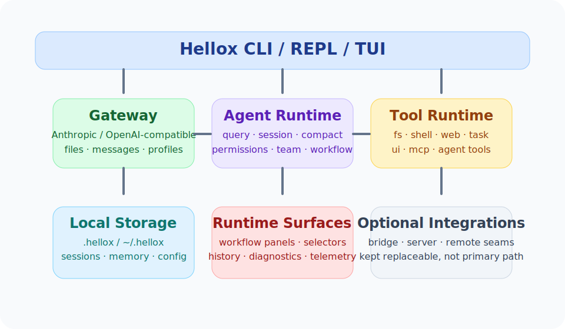
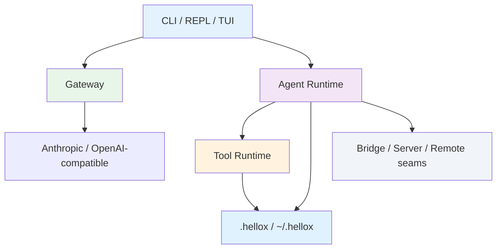

<div align="center">
  
</div>

# Hellox

<div align="center">

**一个 Rust 原生、local-first 的编码代理平台：以 Gateway + CLI + REPL + 工具运行时为核心，重构 Claude Code 的本地能力主链路。**

[](./LICENSE)
[](./Cargo.toml)
[](https://www.rust-lang.org/)
[](./CONTRIBUTING.md)

</div>

<p align="center">
  <a href="./README.md"></a>
  <a href="./README_CN.md"></a>
</p>

---

## 📑 目录

<details>
<summary><strong>点击展开</strong></summary>

- [🎯 为什么选择 Hellox？](#-为什么选择-hellox)
- [✨ 功能特性](#-功能特性)
- [🚀 快速开始](#-快速开始)
- [🔧 工作原理](#-工作原理)
- [📖 文档入口](#-文档入口)
- [🆚 项目定位](#-项目定位)
- [❓ FAQ](#-faq)
- [🛠️ 故障排除](#️-故障排除)
- [🤝 参与贡献](#-参与贡献)
- [📜 许可证](#-许可证)

</details>

## 🎯 为什么选择 Hellox？

如果你想要的是一套**可本地运行、可审计、可改造、可扩展**的 Rust 编码代理栈，这个项目就是为此而做的。

Hellox 的产品边界非常明确：

- 默认 **local-first**
- 未来保留 **remote-capable seam**
- 主路径 **不依赖云端控制台**
- 不是照搬 Claude Code 的 TypeScript 结构，而是用 Rust workspace 重新组织

| 挑战 | 没有 Hellox | 有了 Hellox |
|------|-------------|-----------|
| 本地执行链路 | 需要拼接很多脚本、CLI 和适配层 | 一个 Rust workspace 统一覆盖 gateway、CLI、REPL、tools、session、memory、workflow runtime |
| Provider 接入 | 每家模型接口都不一样 | Gateway 统一本地 API 与 profile/model 抽象 |
| 工具体系 | 文件、shell、MCP、任务、workflow 逻辑分散 | `hellox-tool-runtime` + `hellox-tools-*` 明确分域 |
| Workflow 可视化 | 本地脚本难看、难追踪、难调试 | 已有 overview、panel、run history、run inspect、selector、step lens |
| 多代理本地运行时 | 子代理/团队运行状态容易飘 | 已有 detached process、tmux、iTerm backend 与 runtime reconciliation |

### 💡 最适合
- ✅ **本地 AI 工具开发者**：希望要一个可 hack 的 Rust 代码库，而不是黑盒二进制
- ✅ **重度 CLI / REPL 用户**：想把工作流、状态面板、调试入口放在同一个本地工具里
- ✅ **运行时研究者**：关心 tool registry、permission、telemetry、workflow orchestration

### ⚠️ 不适合
- ❌ 只想立即使用完整托管 SaaS 的用户
- ❌ 当前就需要成熟云端控制平面的团队
- ❌ 期待“Claude Code 全量体验已经 100% 完成”的用户

<div align="center">
  
</div>

## ✨ 功能特性

先说重点：Hellox 的本地主路径已经不是空壳了。

<table>
<tr>
<td width="50%" valign="top">


**🧭 本地 gateway 与 provider 层**

- Anthropic-compatible 本地 gateway
- OpenAI-compatible provider 支持
- 本地文件上传 → 持久化 → `/v1/messages` 消费闭环
- profiles / models / provider adapters 一体化

**你的收益：** 不再需要围着不同 provider 自己拼装一堆适配脚本。

</td>
<td width="50%" valign="top">


**💬 CLI / REPL / TUI 终端面**

- `chat`、`repl`、`session`、`memory`、`tasks`、`workflow`、`mcp`、`plugin`
- 基于 `rustyline` 的 REPL 主循环
- selector + lens 风格面板
- status / doctor / usage / cost 观察面

**你的收益：** 日常操控面已经可用，不只是“规划中”。

</td>
</tr>
<tr>
<td width="50%" valign="top">


**⚡ Tool 与 workflow runtime**

- `Read`、`Write`、`Edit`、`Glob`、`Grep`、`NotebookEdit`
- `Bash` / `PowerShell`、`WebFetch` / `WebSearch`
- task、plan mode、MCP、team、workflow、sleep、remote-trigger seam
- workflow overview / panel / run inspect 均支持 step selector

**你的收益：** 本地 coding-agent 基元已经按 crate 拆清楚，便于持续演进。

</td>
<td width="50%" valign="top">


**🛡️ 可观测性与本地控制**

- persisted sessions、compact、memory lifecycle
- telemetry JSONL sink
- pane-host record/replay harness
- detached process、tmux、iTerm runtime 支持

**你的收益：** 运行时问题更容易追，因为状态和证据都留在本地。

</td>
</tr>
</table>

### 📊 已确认的事实
- **31 个 workspace crates** 已拆出职责边界
- `hellox-cli` **200+ 单测** 已通过
- `cargo test --workspace` **全仓可通过**
- **远程/云端默认不纳入当前主路径验收**

## 🚀 快速开始

### 前置条件
- 已安装 Rust toolchain 与 Cargo
- Windows PowerShell、macOS Terminal 或 Linux shell
- 如果要接真实模型，需要你自己的本地 provider 配置 / API key

### 1. 克隆并编译

```powershell
git clone https://github.com/hellowind777/hellox.git
cd hellox
cargo build
```

### 2. 验证工作区

```powershell
cargo test --workspace
```

预期结果：

```text
test result: ok.
```

### 3. 体验 CLI

```powershell
cargo run -p hellox-cli -- --help
cargo run -p hellox-cli -- repl
```

推荐继续试：

```powershell
cargo run -p hellox-cli -- doctor
cargo run -p hellox-cli -- workflow overview
cargo run -p hellox-cli -- session panel
```

### 一条典型的首次使用链路

```powershell
# 先看运行时状态
cargo run -p hellox-cli -- doctor

# 打开 REPL
cargo run -p hellox-cli -- repl

# 进入 REPL 后可尝试：
/workflow overview
/tasks panel
/memory panel
```

## 🔧 工作原理

### 架构概览

<div align="center">
  
</div>



### 主要层次

| 层 | 作用 | 代表 crate |
|------|------|------|
| CLI 交互层 | 命令路由、REPL driver、终端面板 | `hellox-cli`、`hellox-repl`、`hellox-tui` |
| Query / Agent runtime | session、tool turn、planning、compact | `hellox-agent`、`hellox-query`、`hellox-compact` |
| Tool 抽象层 | 本地 tool registry 与分域工具 crate | `hellox-tool-runtime`、`hellox-tools-*` |
| Gateway / Provider 层 | 模型入口、本地 API、provider adapters | `hellox-gateway`、provider crates |
| 状态 / 记忆 / 观测层 | session、memory、usage、telemetry | `hellox-session`、`hellox-memory`、`hellox-telemetry` |
| 可选本地集成层 | bridge、server、remote seam | `hellox-bridge`、`hellox-server`、`hellox-remote`、`hellox-sync`、`hellox-auth` |

### 一个真实的理解方式

之前：

```text
Provider API、local tools、workflow state、多代理运行时都要自己拼。
```

现在：

```text
Hellox 用一个 Rust workspace 把这些组合起来：
- gateway 负责 provider
- agent/query 负责 orchestration
- tool runtime 负责本地动作
- session/memory/telemetry 负责证据和回放
- workflow panels 负责观察与调试
```

## 📖 文档入口

### 建议先看

| 文档 | 作用 |
|------|------|
| `docs/README.md` | 面向 AI 开发的文档地图和阅读顺序 |
| `docs/AI_DEVELOPMENT_WORKFLOW.md` | AI 开发流程与源码对照规则 |
| `docs/HELLOX_LOCAL_FEATURE_AUDIT.md` | 当前本地能力覆盖度与剩余缺口 |
| `docs/HELLOX_LOCAL_FIRST_BOUNDARIES.md` | local-first / remote-capable 产品边界 |
| `docs/HELLOX_FEATURE_MATRIX.md` | 从 Claude Code 到 Rust crates 的能力映射 |
| `docs/reference/claude-code/ARCHITECTURE.md` | 已归档的原始源码结构分析基线 |
| `docs/HELLOX_PANE_HOST_RECORD_REPLAY.md` | pane-host 回放夹具设计 |

### Workspace 结构

| 领域 | 代表 crate |
|------|------|
| Runtime core | `hellox-agent`、`hellox-query`、`hellox-tool-runtime` |
| User surfaces | `hellox-cli`、`hellox-repl`、`hellox-tui` |
| Gateway / providers | `hellox-gateway`、`hellox-provider-anthropic`、`hellox-provider-openai-compatible` |
| Storage / memory / telemetry | `hellox-session`、`hellox-memory`、`hellox-telemetry`、`hellox-sync` |
| Tool domains | `hellox-tools-fs`、`hellox-tools-shell`、`hellox-tools-web`、`hellox-tools-task`、`hellox-tools-ui`、`hellox-tools-agent`、`hellox-tools-mcp` |
| Local integration seams | `hellox-bridge`、`hellox-server`、`hellox-remote`、`hellox-auth` |

## 🆚 项目定位

| 方案 | 擅长什么 | 代价 | Hellox 的优势 |
|------|------|------|------|
| 托管式 coding agent | 上手快 | 本地控制弱 | Hellox 更适合本地可审计、可改造的运行时 |
| 普通 Rust CLI | 范围小，易维护 | 没有 agent 栈 | Hellox 已包含 gateway、tools、workflow、memory、多代理 seam |
| 零散本地脚本 | 灵活试验 | 难以扩展和调试 | Hellox 提供结构化 crate 与持久化运行证据 |

## ❓ FAQ

<details>
<summary><strong>Q：Hellox 是不是 Claude Code 的完整克隆？</strong></summary>

**A：** 不是。它是按本地能力矩阵推进的 Rust 重构版本。当前目标不是云端 1:1 复刻，而是先把本地主路径做到扎实。
</details>

<details>
<summary><strong>Q：Hellox 运行必须依赖服务器吗？</strong></summary>

**A：** 主路径不需要。项目只保留用户自定义远程目标作为可选 seam，不把托管云端服务作为目标。
</details>

<details>
<summary><strong>Q：REPL 现在已经可交互了吗？</strong></summary>

**A：** 是的。已经支持 slash commands、selector 风格面板、workflow 导航、memory/tasks/session 面板，以及 `rustyline` 输入循环。
</details>

<details>
<summary><strong>Q：现在最大的缺口是什么？</strong></summary>

**A：** 主要是更完整的交互式 `hellox-tui` 应用层、更强的 visual workflow authoring，以及非 Windows 环境下的真实 tmux/iTerm fixtures。
</details>

<details>
<summary><strong>Q：在 Windows 上能验证 tmux/iTerm 吗？</strong></summary>

**A：** 可以跑 fake-host / contract tests 和 replay harness，但真实宿主编排证据仍需要 macOS/Linux 录制。
</details>

<details>
<summary><strong>Q：如果我要贡献，从哪里开始最合适？</strong></summary>

**A：** 建议先读 `docs/README.md` 和 `docs/AI_DEVELOPMENT_WORKFLOW.md`，再把 `docs/HELLOX_LOCAL_FEATURE_AUDIT.md` 与相关源码 crate 对照起来看。
</details>

## 🛠️ 故障排除

### 1. `cargo test --workspace` 跑得比较慢

**原因：** workspace crate 较多，而且包含一些长跑的 agent/runtime 测试。

**做法：**

```powershell
cargo test -p hellox-cli
cargo test -p hellox-agent
```

### 2. 推送 GitHub 时提示当前目录不是 git 仓库

**原因：** 这个工作区最开始可能只是一个普通本地目录。

**修复：**

```powershell
git init -b main
git add .
git commit -m "初始化仓库"
```

### 3. Workflow panel 已能显示，但交互还不够“图形化”

**原因：** 当前已有 selector + lens + run inspect 等终端面，但完整 visual authoring 仍在持续补齐。

**做法：** 现阶段优先使用 `workflow overview`、`workflow panel`、`workflow runs`、`workflow show-run` 这条已支持路径。

### 4. Windows 上很难还原真实 pane host 行为

**原因：** tmux / iTerm 的真实宿主环境天然偏向 macOS / Linux。

**做法：** 先用 replay harness 回放，再在后续非 Windows 环境中补录真实夹具。

### 5. 启动后 provider 请求失败

**原因：** 本地 config 或凭据可能还没配全。

**做法：**

```powershell
cargo run -p hellox-cli -- config show
cargo run -p hellox-cli -- doctor
```

## 🤝 参与贡献

详见 [CONTRIBUTING.md](./CONTRIBUTING.md)。

当前最值得投入的方向包括：

- 更完整的 `hellox-tui` 交互层
- workflow visual authoring
- tmux / iTerm fixture 录制与回放证据
- local team-memory 与 assistant viewer 增强

## 📜 许可证

本项目采用 [Apache-2.0 许可证](./LICENSE)。

详见 [LICENSE](./LICENSE)。

---

<div align="center">

为本地优先的 coding agent 未来而构建。

[⬆ 返回顶部](#hellox)

</div>
